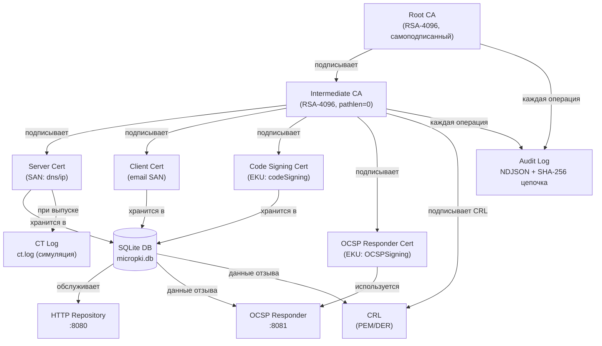

# MicroPKI

A minimal Public Key Infrastructure (PKI) tool for creating and managing Certificate Authorities, issuing certificates, and serving them via an HTTP repository.

## Dependencies

- **Python** ≥ 3.9
- **cryptography** ≥ 3.0

## Installation

```bash
git clone <repository-url>
cd micropki
python -m venv venv
venv\Scripts\activate       # Windows
# source venv/bin/activate  # Linux/macOS
pip install -r requirements.txt
```

## Quick Start

### 1. Initialize Database & Root CA

```bash
mkdir secrets
echo my-root-passphrase > secrets/root.pass

python -m micropki db init --db-path ./pki/micropki.db

python -m micropki ca init \
    --subject "/CN=Demo Root CA/O=MyOrg/C=US" \
    --key-type rsa --key-size 4096 \
    --passphrase-file ./secrets/root.pass \
    --out-dir ./pki --validity-days 3650
```

### 2. Issue Intermediate CA

```bash
echo my-intermediate-pass > secrets/intermediate.pass

python -m micropki ca issue-intermediate \
    --root-cert ./pki/certs/ca.cert.pem \
    --root-key ./pki/private/ca.key.pem \
    --root-pass-file ./secrets/root.pass \
    --subject "CN=MicroPKI Intermediate CA,O=MyOrg" \
    --key-type rsa --key-size 4096 \
    --passphrase-file ./secrets/intermediate.pass \
    --out-dir ./pki --validity-days 1825 --pathlen 0
```

### 3. Issue Certificates

```bash
# Server certificate (SAN required)
python -m micropki ca issue-cert \
    --ca-cert ./pki/certs/intermediate.cert.pem \
    --ca-key ./pki/private/intermediate.key.pem \
    --ca-pass-file ./secrets/intermediate.pass \
    --template server \
    --subject "CN=example.com,O=MyOrg" \
    --san dns:example.com --san dns:www.example.com --san ip:192.168.1.10 \
    --out-dir ./pki/certs

# Client certificate
python -m micropki ca issue-cert \
    --ca-cert ./pki/certs/intermediate.cert.pem \
    --ca-key ./pki/private/intermediate.key.pem \
    --ca-pass-file ./secrets/intermediate.pass \
    --template client \
    --subject "CN=Alice Smith" \
    --san email:alice@example.com \
    --out-dir ./pki/certs

# Code signing certificate
python -m micropki ca issue-cert \
    --ca-cert ./pki/certs/intermediate.cert.pem \
    --ca-key ./pki/private/intermediate.key.pem \
    --ca-pass-file ./secrets/intermediate.pass \
    --template code_signing \
    --subject "CN=MicroPKI Code Signer" \
    --out-dir ./pki/certs
```

### 4. Query Certificates

```bash
# List all certificates
python -m micropki ca list-certs --db-path ./pki/micropki.db

# Filter by status
python -m micropki ca list-certs --status valid --format table

# Export as JSON or CSV
python -m micropki ca list-certs --format json
python -m micropki ca list-certs --format csv

# Show a specific certificate by serial
python -m micropki ca show-cert 67BA... --db-path ./pki/micropki.db
```

### 5. Start Repository Server

```bash
python -m micropki repo serve --host 0.0.0.0 --port 8080 --db-path ./pki/micropki.db --cert-dir ./pki/certs
```

API endpoints:
```bash
# Fetch certificate by serial
curl http://localhost:8080/certificate/67BA...

# Fetch Root CA
curl http://localhost:8080/ca/root

# Fetch Intermediate CA
curl http://localhost:8080/ca/intermediate

# CRL placeholder (returns 501)
curl http://localhost:8080/crl
```

### Output Structure

```
pki/
├── private/
│   ├── ca.key.pem               # Encrypted Root CA key
│   └── intermediate.key.pem     # Encrypted Intermediate CA key
├── certs/
│   ├── ca.cert.pem              # Root CA certificate
│   ├── intermediate.cert.pem    # Intermediate CA certificate
│   ├── example.com.cert.pem     # Server certificate
│   └── example.com.key.pem      # Server key (unencrypted)
├── csrs/
│   └── intermediate.csr.pem     # Intermediate CA CSR
├── micropki.db                  # Certificate database (SQLite)
└── policy.txt                   # Certificate policy document
```

## Running Tests

```bash
pytest tests/ -v
```

## Project Structure

```
micropki/
├── micropki/
│   ├── __init__.py        # Package marker
│   ├── __main__.py        # python -m micropki entry point
│   ├── cli.py             # CLI parser (all commands)
│   ├── ca.py              # CA operations orchestration
│   ├── certificates.py    # X.509 certificate builder
│   ├── crypto_utils.py    # Key generation, PEM, DN parsing
│   ├── csr.py             # CSR generation
│   ├── templates.py       # Шаблоны сертификатов и обработка SAN
│   ├── database.py        # SQLite-база + таблица compromised_keys (Sprint 7)
│   ├── serial.py          # Генератор уникальных серийных номеров
│   ├── repository.py      # HTTP-репозиторий сертификатов
│   ├── logger.py          # Настройка логирования
│   ├── audit.py           # Sprint 7: NDJSON-журнал с SHA-256 цепочкой хешей
│   ├── policy.py          # Sprint 7: политики размера ключа, срока, SAN
│   ├── transparency.py    # Sprint 7: симуляция Certificate Transparency лога
│   ├── compromise.py      # Sprint 7: симуляция компрометации ключа
│   └── ratelimit.py       # Sprint 7: token bucket rate limiter
├── tests/
│   ├── test_crypto_utils.py   # Unit-тесты: ключи, DN, PEM
│   ├── test_ca.py             # Sprint 1 интеграционные тесты
│   ├── test_cli.py            # CLI-тесты
│   ├── test_templates.py      # Шаблоны и SAN
│   ├── test_sprint2.py        # Sprint 2
│   ├── test_sprint3.py        # Sprint 3: БД, serial, HTTP
│   ├── test_sprint4.py        # Sprint 4: CRL, OCSP
│   ├── test_sprint5.py        # Sprint 5: OCSP-responder
│   ├── test_sprint6.py        # Sprint 6: клиент, CSR, репозиторий
│   └── test_sprint7.py        # Sprint 7: аудит, политики, CT, компрометация
├── requirements.txt
├── .gitignore
└── README.md
```

---

## Sprint 7: Безопасность и аудит

### Система аудита (NDJSON + SHA-256 цепочка хешей)

Каждое событие записывается в `./pki/audit/audit.log` в формате NDJSON:

```json
{
  "timestamp": "2026-05-11T10:00:00.123456Z",
  "level": "AUDIT",
  "operation": "issue_certificate",
  "status": "success",
  "message": "Выпущен сертификат server: CN=example.com",
  "metadata": {"serial": "2A7F...", "template": "server"},
  "integrity": {"prev_hash": "abc123...", "hash": "def456..."}
}
```

Поле `integrity.hash` — SHA-256 от канонического JSON записи (ключи отсортированы).
Поле `integrity.prev_hash` — хеш предыдущей записи (первая запись: 64 нуля).

#### Проверка целостности журнала

```bash
# Полная проверка журнала
micropki audit verify --log-file ./pki/audit/audit.log

# Поиск записей по фильтрам
micropki audit query --operation issue_certificate --format table
micropki audit query --from 2026-05-01T00:00:00Z --level AUDIT --format json

# Проверка целостности при запросе
micropki audit query --serial ABCD1234 --verify
```

### Политики безопасности

| Политика            | Root CA      | Intermediate CA | End-Entity  |
|:--------------------|:-------------|:----------------|:------------|
| RSA мин. размер     | 4096 бит     | 2048 бит        | 2048 бит    |
| ECC мин. кривая     | P-384        | P-384           | P-256       |
| Макс. срок (дней)   | 3650 (10 лет)| 1825 (5 лет)    | 365 (1 год) |

SAN-ограничения по шаблону:

| Шаблон        | Разрешённые типы SAN         | Wildcard (`*.`) |
|:--------------|:-----------------------------|:----------------|
| `server`      | dns, ip                      | запрещён        |
| `client`      | dns, email, ip, uri          | разрешён        |
| `code_signing`| dns, uri                     | разрешён        |

### Симуляция компрометации ключа

```bash
# Симуляция компрометации с аварийным обновлением CRL
micropki ca compromise \
    --cert ./pki/certs/example.com.cert.pem \
    --db   ./pki/micropki.db \
    --reason keyCompromise \
    --audit-dir ./pki/audit \
    --ca-cert ./pki/ca/certs/ca.cert.pem \
    --ca-key  ./pki/ca/private/ca.key.pem \
    --passphrase-file secrets/ca.pass \
    --out-dir ./pki/ca
```

После компрометации:
- Сертификат отзывается в БД с причиной `keyCompromise`.
- Публичный ключ записывается в таблицу `compromised_keys`.
- Любой новый выпуск с тем же ключом будет **отклонён**.
- Генерируется аварийный CRL.

### Certificate Transparency (симуляция)

При каждом выпуске сертификата (если задан `--audit-dir`) в файл
`./pki/audit/ct.log` добавляется строка:

```
2026-05-11T10:00:00Z|2A7F8B3C...|CN=example.com|SHA256-FINGERPRINT|CN=Root CA
```

Проверка присутствия сертификата:
```bash
grep "2A7F8B3C" ./pki/audit/ct.log
```

### Rate Limiting

Серверы `repo serve` и `ocsp serve` поддерживают ограничение скорости по IP:

```bash
micropki repo serve --host 0.0.0.0 --port 8080 --rate-limit 5 --rate-burst 10
```

При превышении лимита сервер отвечает `HTTP 429 Too Many Requests`
с заголовком `Retry-After: N`.

---

## CI Badge


Coverage: see CI

---

## Sprint 8: Demo Walkthrough

### Запуск автоматизированного демо

```bash
# Через CLI-команду
python -m micropki demo run

# Напрямую
python demo/demo.py
```

Скрипт `demo/demo.py` запускает полный PKI-сценарий во временной директории:

1. Инициализация Root CA (RSA-4096, самоподписанный)
2. Выпуск Intermediate CA (RSA-4096, pathlen=0)
3. Выпуск server-сертификата (SAN: dns:demo.local, ip:127.0.0.1)
4. Выпуск client-сертификата
5. Выпуск OCSP responder-сертификата
6. Выпуск code-signing сертификата
7. Валидация server-сертификата через цепочку
8. Генерация CRL и проверка статуса
9. Отзыв server-сертификата
10. Проверка что отозванный сертификат зафиксирован в БД как `revoked`
11. Проверка целостности аудит-лога (SHA-256 хеш-цепочка)
12. Проверка политики (RSA-2048 для CA отвергается)
13. TLS демо: Python HTTPS-сервер + TLS-клиент с нашим Root CA как доверенным
14. Code signing: подпись файла приватным ключом + верификация через сертификат
15. Итоговая статистика с цветным выводом `[PASS]` / `[FAIL]`

Для каждого шага выводится цветная метка — зелёная `[PASS]` или красная `[FAIL]`.
Скрипт идемпотентен: использует `tempfile.mkdtemp()`, каждый запуск — чистое окружение.

---

## TLS Integration

Запуск встроенного Python HTTPS-сервера с сертификатом MicroPKI:

```bash
# 1. Выпустить server-сертификат (см. Quick Start, шаг 3)
# 2. Создать цепочку (leaf + intermediate)
cat pki/certs/example.com.cert.pem pki/certs/intermediate.cert.pem > chain.pem

# 3. Запустить HTTPS-сервер
python -c "
import ssl, http.server
ctx = ssl.SSLContext(ssl.PROTOCOL_TLS_SERVER)
ctx.load_cert_chain('chain.pem', 'pki/certs/example.com.key.pem')
httpd = http.server.HTTPServer(('0.0.0.0', 8443), http.server.SimpleHTTPRequestHandler)
httpd.socket = ctx.wrap_socket(httpd.socket, server_side=True)
httpd.serve_forever()
"

# 4. Проверить через openssl s_client
openssl s_client -connect localhost:8443 -CAfile pki/certs/ca.cert.pem

# 5. Или через curl
curl --cacert pki/certs/ca.cert.pem https://localhost:8443/
```

---

## Code Signing

Подпись файла приватным ключом (RSA PKCS#1v15 SHA-256 или ECDSA SHA-256):

```bash
# Подписать файл
python -m micropki client sign \
    --key pki/certs/MicroPKI_Code_Signer.key.pem \
    --file script.py \
    --out script.py.sig

# Проверить подпись
python -m micropki client verify \
    --cert pki/certs/MicroPKI_Code_Signer.cert.pem \
    --file script.py \
    --sig script.py.sig \
    --trusted pki/certs/ca.cert.pem
```

Команда `verify` проверяет:
- Криптографическую корректность подписи
- Срок действия сертификата подписанта
- Принадлежность сертификата к доверенной цепочке

---

## Architecture Diagram



---

## Security Considerations

Проект создан в образовательных целях. Перед использованием в продакшне учтите:

- **Незашифрованные ключи конечных субъектов** — `client gen-csr` и `ca issue-cert`
  сохраняют приватные ключи без шифрования. Защитите файл через FS-права или
  зашифруйте вручную: `openssl pkcs8 -topk8 -in key.pem -out key.enc.pem`.

- **Пароли в файлах** — `--passphrase-file` читает пароль из файла открытым текстом.
  Используйте права доступа `600` и не храните файлы паролей в git.

- **OCSP без HTTPS** — OCSP-респондер работает по plain HTTP. В реальной среде
  оберните в nginx/caddy с TLS.

- **Аудит-лог без внешней подписи** — SHA-256 хеш-цепочка защищает от тихой
  модификации, но не от замены всего файла. Для production используйте append-only
  хранилище или внешнюю подпись лога.

- **SQLite без шифрования** — база данных хранится как обычный файл. Рассмотрите
  шифрование на уровне файловой системы (LUKS, BitLocker, FileVault).

- **Нет проверки OCSP при выдаче** — промежуточный CA не проверяет OCSP своего
  издателя. В реальном PKI цепочка OCSP должна быть полной.

- **Временны́е метки без NTP** — аудит-записи используют системное время. Убедитесь
  что на сервере настроен NTP для корректного порядка записей.

- **demo/demo.py не для продакшна** — скрипт генерирует случайные пароли и хранит
  всё во временной директории. Не используйте его ключи/сертификаты где-либо ещё.
